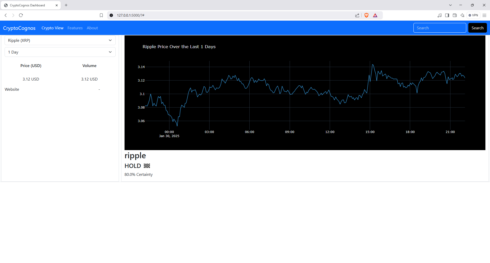

# CryptoCognosV2 Dashboard
      


CryptoCognos is a cryptocurrency dashboard that provides real-time data, technical analysis indicators, and recommendations to help users decide whether to **<span style="color:green">BUY</span>**, **<span style="color:red">SELL</span>**, or **<span style="color:blue">HOLD</span>** their cryptocurrency assets. It uses data from the CoinGecko API and displays it interactively with **Plotly** charts.



## Features

- **Real-time cryptocurrency data**: Fetches the latest price and trading volume of any cryptocurrency from the CoinGecko API.
- **Technical Indicators**: Calculates various technical analysis indicators like:
  - **Exponential Moving Averages (EMA)**
  - **Relative Strength Index (RSI)**
  - **Moving Average Convergence Divergence (MACD)**
  - **Bollinger Bands**
  - **Average Directional Index (ADX)**
- **Recommendation Engine**: Generates a recommendation to **<span style="color:green">BUY</span>**, **<span style="color:red">SELL</span>**, or **<span style="color:blue">HOLD</span>** based on the calculated indicators.
- **Graphical Visualization**: Interactive price graph using **Plotly** to visualize the price of a selected cryptocurrency over a given period.
- **Customizable Search**: Allows users to search for cryptocurrencies and view the data over customizable time periods (1, 3, 7, 30 days, etc.).
- **Flask Web App**: The app is built with **Flask** to serve the data, handle user requests, and display results on a user-friendly interface.

## Installation

To run the CryptoCognos Dashboard locally, follow these steps:

### Prerequisites
- Python 3.x
- `pip` (Python package manager)

### Step 1: Clone the repository

```bash
git clone https://github.com/pedrolucas7i/CryptoCognosV2.git
cd CryptoCognosV2
```

### Step 2: Install dependencies

Install the required Python libraries using `pip`:

```bash
pip3 install -r requirements.txt`
```

The `requirements.txt` file includes:

-   coinpaprika-sdk
-   Flask
-   pandas
-   pandas_ta
-   plotly
-   requests

### Step 3: Run the Flask application

Start the Flask app:

```bash
python app.py
```

By default, the app will run at http://127.0.0.1:5000.

### Step 4: Access the Dashboard

Open your browser and go to http://127.0.0.1:5000 to view the dashboard.

How it Works
------------

1.  **Cryptocurrency Data Fetching**: The app fetches cryptocurrency data (price and volume) from the CoinGecko API. The user can specify the cryptocurrency (e.g., Bitcoin) and the time period (e.g., 1 day, 7 days).
2.  **Technical Indicators Calculation**: The app processes the fetched data and calculates several technical indicators:
    -   **EMA (Exponential Moving Averages)**
    -   **RSI (Relative Strength Index)**
    -   **MACD (Moving Average Convergence Divergence)**
    -   **Bollinger Bands**
    -   **ADX (Average Directional Index)**
3.  **Recommendation Generation**: Based on the calculated indicators, a score is generated to recommend whether the user should **BUY**, **SELL**, or **HOLD** the cryptocurrency.
4.  **Graph Display**: The app uses **Plotly** to display an interactive chart showing the cryptocurrency price over the selected time period.
5.  **Error Handling**: The app handles potential errors like API request limits or missing data and displays appropriate messages to the user.

Example
-------

API Endpoints
-------------

### `/crypto-data`

Fetches real-time cryptocurrency data and technical analysis.

**Parameters**:

-   `crypto`: The cryptocurrency symbol (e.g., `bitcoin`, `ripple`, `dogecoin`).
-   `days`: The number of days to show historical data (e.g., 1, 7, 30).

**Response**:

```json
{
  "graph": "Plotly graph JSON data",
  "indication": "BUY 🚀",
  "certainty": "80% Certainty",
  "price": 12345.67,
  "volume": 1234567890.00
}
```

### `/`

Renders the main dashboard page with the latest cryptocurrency data and recommendations.

Contributing
------------

If you are interested in my project, email [me](mailto:pedrolucas.core7i@gmail.com).

License
-------

This project is licensed under the [Non-Commercial License](./LICENSE) - see the LICENSE file for details.

Acknowledgements
----------------

-   [CoinGecko API](https://www.coingecko.com/) for providing real-time cryptocurrency data.
-   [Plotly](https://plotly.com/) for the powerful charting library.
-   Pandas and [Pandas TA](https://github.com/twopirllc/pandas-ta) for the technical analysis calculations.